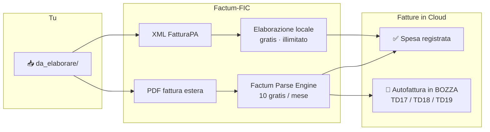

<div align="center">
  
  <h1> Fatture in Cloud - Factum Tool</h1>
  <p><strong>Le tue fatture estere? Le registra Factum-FIC su Fatture in Cloud.<br>
  Da sole. In 3 secondi. Zero abbonamenti.</strong></p>
</div>

<p align="center">
  <a href="https://www.python.org/downloads/"></a>
  <a href="LICENSE"></a>
  <a href="https://github.com/FTG-003/factum-fic/releases"></a>
  <a href="#quanto-costa"></a>
</p>

---

## Il problema (te lo spiego semplice)

Hai una Partita IVA in Regime Forfettario. Ogni mese compri strumenti digitali dall'estero: **Hetzner, AWS, GitHub, OpenAI, Google Workspace, Canva, Notion**.

Ogni fattura significa:
1. Scaricare il PDF dal sito del fornitore
2. Aprire Fatture in Cloud e ricopiare a mano data, importo, fornitore
3. Capire se serve l'autofattura (TD17? TD18? TD19? Mah.)
4. Calcolare il reverse charge senza sbagliare
5. Compilare l'autofattura
6. Verificare e spedire al Sistema di Interscambio SDI, gestito dall'Agenzia delle Entrate
7. Ripetere per ogni fattura

**Ogni mese perdi 2-3 ore in questa trafila.**

Factum-FIC fa tutto da solo. Tu lasci i file in una cartella, lanci un comando, e lui registra tutto su Fatture in Cloud. Comprese le autofatture per i fornitori esteri.

---

## Come funziona (in parole povere)



### Cosa succede

Metti i file in `da_elaborare/`. Factum-FIC fa tutto da solo:

- **È un XML** (da fornitore italiano o SDI)? Lo legge in locale, gratis, i tuoi dati non escono dal computer. La spesa finisce su FIC.
- **È un PDF** (Hetzner, AWS, OpenAI…)? Estrae il testo, lo analizza in sicurezza e registra la spesa su FIC. Se il fornitore è estero, genera anche l'autofattura in **bozza** (TD17/18/19), pronta da controllare e inviare.

---

## Quanto costa (trasparenza totale)

| Cosa | Costo |
|---|---|
| **Fatture XML italiane** (Aruba, fornitori IT, SDI) | **€0 — gratis e illimitate**. Elaborazione 100% sul tuo computer. |
| **Fatture PDF estere** (Hetzner, AWS, OpenAI, ecc.) | **10 al mese gratis per sempre**. Poi €9,90 per 100 PDF aggiuntivi (una tantum, senza scadenza). |

> 💡 **10 PDF al mese bastano per oltre l'80% dei forfettari.** Hosting, dominio, AI, SaaS vari. Se stai iniziando, molto probabilmente non spenderai mai un centesimo.

---

## Come iniziare (in 3 minuti, senza essere programmatore)

Apri il **Terminale** (Mac/Linux) o **PowerShell** (Windows).

### 1. Installa

Copia e incolla questo comando:

```bash
pipx install git+https://github.com/FTG-003/factum-fic
```

Se ti dice "comando non trovato", prova con:

```bash
uv tool install git+https://github.com/FTG-003/factum-fic
```

### 2. Configura (solo la prima volta)

```bash
factum-fic setup
```

La procedura ti guida passo-passo:
- **Token Fatture in Cloud**: lo generi dal tuo account FIC (Impostazioni → API → Personal Access Token)
- **Chiave Factum**: si attiva da sola, gratis. 10 PDF al mese, collegati alla tua Partita IVA.

### 3. Usalo tutti i mesi

Metti le fatture nella cartella `da_elaborare/`:

```bash
cp ~/Downloads/fattura_*.xml ./da_elaborare/
```

Poi lancia:

```bash
factum-fic elabora
```

Apri Fatture in Cloud: le spese sono già registrate, le autofatture sono già pronte. Fatto.

---

## Prova subito (anche senza fatture vere)

Nel repository c'è tutto quello che ti serve per vedere Factum-FIC in azione con dati finti.

### Scenario 1: fattura estera PDF

Genera una fattura Hetzner finta (reverse charge, 2 pagine, realisticissima):

```bash
uv run python scripts/make_test_pdf.py da_elaborare/Hetzner-luglio.pdf
factum-fic elabora
```

Factum-FIC la analizza, riconosce il fornitore tedesco, crea la spesa su FIC e prepara l'autofattura **TD18** (fornitore UE con Partita IVA).

### Scenario 2: XML fornitore estero

Il repository include già un XML FatturaPA di esempio:

```bash
cp tests/fixtures/sample_einvoice.xml da_elaborare/
factum-fic elabora
```

Questa è una fattura DigitalOcean (USA) → Factum-FIC la parsaa in locale, registra la spesa e prepara l'autofattura **TD17** (extra-UE).

> 💡 **Nessun credito consumato.** Lo scenario 2 è 100% locale e gratuito. Lo scenario 1 consuma 1 dei tuoi 10 PDF gratis mensili.

---

## Comandi principali (tutti in italiano)

| Comando | Cosa fa |
|---|---|
| `factum-fic setup` (`configura`) | Configurazione guidata (una volta sola) |
| `factum-fic sync` (`elabora`) | Elabora tutti i file in `da_elaborare/` |
| `factum-fic status` (`stato`) | Mostra quanti crediti PDF ti restano, lo stato della coda, la connessione FIC |
| `factum-fic watch` (`auto`) | Resta in esecuzione ed elabora i file appena li trascini |
| `factum-fic riprova-autofatture` | Recupera le autofatture che non erano riuscite |
| `factum-fic ricarica` | Acquista 100 PDF extra (€9,90) |

---

## Come gestisce il reverse charge

Quando compri da un fornitore estero, serve un'autofattura. Factum-FIC sceglie quella giusta in automatico:

| Fornitore | Tipo autofattura |
|---|---|
| **Extra-UE** (USA, UK, Svizzera…) | **TD17** |
| **Unione Europea** con Partita IVA (Germania, Francia…) | **TD18** |
| **Unione Europea** senza Partita IVA | **TD19** |
| Fornitore italiano | Spesa diretta (nessuna autofattura) |

> ⚠️ **Importante**: IVA = 0 non significa sempre reverse charge. Un fornitore italiano forfettario ha IVA = 0 ma non serve autofattura. Factum-FIC lo riconosce da solo.

---

## I tuoi dati sono al sicuro

| Tipo file | Dove viene elaborato |
|---|---|
| **XML FatturaPA** | **100% sul tuo computer.** Mai trasmesso a nessuno. |
| **PDF fattura** | Solo il **testo estratto** viene inviato via HTTPS. Mai il file originale. Mai memorizzato. |
| **Fatture in Cloud** | Solo i dati contabili, tramite il tuo token personale. |

Le credenziali stanno nel file `.env` (che è gitignorato, mai condiviso).

---

## Perché esiste Factum-FIC (e non uno scriptino)

Se hai provato a scrivere uno script per automatizzare Fatture in Cloud, sai che:
- Se lo lanci due volte, duplica le spese
- Se FIC è giù, perdi tutto
- Se l'autofattura fallisce, te ne accodi dopo un mese
- Non hai idea di quali file siano stati elaborati e quali no

Factum-FIC ha una **coda persistente** (SQLite) che tiene traccia di tutto: file già processati, errori, autofatture da ritentare, crediti rimanenti. Ogni file ha un'impronta digitale (SHA-256) così non viene mai elaborato due volte. Se qualcosa va storto, lo recuperi con un comando.

---

## Vuoi contribuire o hai bisogno di aiuto?

- **Hai trovato un bug?** [Apri una issue](https://github.com/FTG-003/factum-fic/issues)
- **Vuoi sviluppare?** Vedi [`CONTRIBUTING.md`](CONTRIBUTING.md)
- **Problemi di sicurezza?** Scrivi a info@pyragogy.org (vedi [`SECURITY.md`](SECURITY.md))

---

## Licenza

**AGPL-3.0** — open source, copyleft.

Puoi usarlo per la tua Partita IVA gratis, senza limiti. Puoi modificarlo. Se lo offri come servizio a terzi, devi rilasciare le modifiche.

[Testo completo della licenza →](LICENSE)

*Nota: Factum Parse Engine è un servizio SaaS separato (documentazione su [docs.factum.pyragogy.org](https://docs.factum.pyragogy.org/)).*

---

<div align="center">
  <sub>Fatto con ❤️ per chi ha una Partita IVA e ha di meglio da fare che ricopiare fatture a mano.<br>
  Non è consulenza fiscale. Verifica sempre col tuo commercialista.</sub>
</div>
