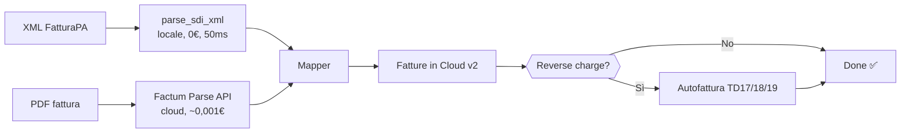

<div align="center">
  
  <h1>Factum FIC</h1>
  <p><strong>Le tue fatture estere, autofatturate da sole.<br>Zero abbonamenti Enterprise.</strong></p>
</div>

<p align="center">
  <a href="https://www.python.org/downloads/"></a>
  <a href="https://github.com/FTG-003/factum-fic/actions/workflows/ci.yml"></a>
  <a href="LICENSE"></a>
  <a href="https://github.com/FTG-003/factum-fic/releases"></a>
  <br>
  <a href="https://img.shields.io/badge/185%20test%20passati-9ece6a?logo=pytest"></a>
  <a href="https://github.com/astral-sh/ruff"></a>
  <a href="https://img.shields.io/badge/XML%20SDI-100%25%20offline-73daca"></a>
</p>

---

## 🧠 Il problema

*Hai una Partita IVA in Regime Forfettario. Arrivano fatture da **Hetzner**, **AWS**,
**GitHub**, **Google Cloud**, **DigitalOcean**, **Shopify**.*

Ogni fornitore estero significa:
1. Devi registrare la spesa in contabilità
2. Se è extra-UE o UE con IVA=0, devi emettere **autofattura** (TD17/TD18/TD19)
3. Se sbagli il reverse charge, sono guai con l'Agenzia delle Entrate
4. Farlo a mano per ogni fattura è una rottura

**Factum FIC** fa tutto da solo. In locale. Gratis.

---

## 🚀 Quickstart

```bash
# Installa in 3 secondi
uv tool install factum-fic

# Configura
factum-fic setup     # ti guida passo-passo

# Metti le fatture in elaborazione
cp ~/Downloads/fattura_*.xml ./da_elaborare/

# Un comando e sei a posto
factum-fic elabora

# Verifica
factum-fic stato     # o "factum-fic status"
```

---

## 📊 Open Core: cosa è gratis e cosa no

| Funzionalità | Core (gratuito) | Con Factum Parse |
|---|---|---|
| **XML FatturaPA (SDI)** | ✅ Parsing 100% locale, offline, 0€ | ✅ Idem |
| **Reverse charge automatico** | ✅ N6.x + fornitore estero | ✅ Idem |
| **Autofatture TD17/TD18/TD19** | ✅ Generate su FIC | ✅ Idem |
| **Fatture in Cloud v2** | ✅ Spese + allegati + pagamento | ✅ Idem |
| **PDF fattura** | ❌ Servizio cloud esterno | ✅ ~0,001€/doc |
| **OCR scontrini** | ❌ Servizio cloud esterno | ✅ ~0,001€/doc |
| **Costi** | **€ 0 — zero** | ~€ 0,001 per PDF |
| **Rete necessaria** | ❌ No (solo per XML) | ✅ Sì |
| **Licenza** | AGPL-3.0 (open source) | SaaS separato |

> **Hai solo XML FatturaPA?** Factum FIC funziona completamente offline, zero API,
> zero costi, zero configurazioni cloud. Metti i file XML in `da_elaborare/` e via.

---

## 🏛️ Come funziona



### Componenti

| Componente | Cosa fa | Dove gira |
|---|---|---|
| `parse_sdi_xml()` | Legge XML FatturaPA, estrae fornitore, importi, IVA, natura | **Locale** — 0 API, 0€ |
| `Factum Parse API` | Estrae testo da PDF non strutturati | Cloud (~0,001€/doc) |
| `Mapper` | Classifica spesa/autofattura, costruisce payload FIC | Locale |
| `FIC v2 API` | Crea spesa + autofattura su Fatture in Cloud | Cloud FIC |
| `Queue` | Coda SQLite con lock atomico e deduplicazione | Locale |
| `Watcher` | Monitora hotfolder in tempo reale | Locale |

---

## 🔬 Reverse charge e autofatture

Il reverse charge in Italia è un ginepraio. Factum FIC lo gestisce correttamente:

### Logica di classificazione

| Fornitore | Paese | Reverse charge? | Tipo autofattura |
|---|---|---|---|
| Extra-UE (USA, UK, Svizzera…) | US, GB, CH… | ✅ Sì | **TD17** |
| Intra-UE con P.IVA | DE, FR, ES… | ✅ Sì (se IVA=0) | **TD18** |
| Intra-UE senza P.IVA | DE, FR, ES… | ✅ Sì | **TD19** |
| Intra-UE con IVA pagata | DE, FR… | ❌ No | Spesa diretta |
| Fornitore italiano forfettario | IT | ❌ No (N2.2) | Spesa diretta |
| Fornitore italiano esente | IT | ❌ No (N4) | Spesa diretta |
| Fornitore italiano RC | IT | ✅ Sì (N6.x) | TD16 (interna) |

### Tabella codici Natura SDI

| Codice | Significato | RC? |
|---|---|---|
| N2.2 | Forfettario | ❌ |
| N4 | Esente art. 10 | ❌ |
| **N6.x** | **Inversione contabile** | ✅ |
| N7 | IVA assolta in altro stato UE | ❌ |

> La regola d'oro: **IVA=0 non significa reverse charge**. Un forfettario (N2.2)
> ha IVA=0 ma NON è reverse charge. Factum FIC controlla il tag `<Natura>` SDI
> e il paese del fornitore, non solo l'importo IVA.

---

## 🛠️ Comandi CLI

| Comando | Alias italiano | Cosa fa |
|---|---|---|
| `sync` | `elabora` | Elabora file in `da_elaborare/` |
| `status` | `stato` | Dashboard API, coda, stato |
| `history` | `storico` | Cronologia elaborazioni |
| `setup` | `configura` | Configurazione guidata |
| `watch` | `auto` | Monitoraggio hotfolder |
| `riprova-autofatture` | — | Recupera autofatture fallite |

```bash
# Alias funzionano ovunque
factum-fic elabora          # come "sync"
factum-fic stato            # come "status"
factum-fic storico          # come "history"
factum-fic configura        # come "setup"
factum-fic auto             # come "watch"
```

### Recupero autofatture fallite

Se un'autofattura SDI fallisce (es. FIC temporaneamente down), la spesa
è comunque salvata. Puoi riprovare in seguito:

```bash
factum-fic riprova-autofatture
```

---

## 📦 Installazione

### uv (consigliato)

```bash
uv tool install factum-fic
```

### pip

```bash
pip install factum-fic
```

### Da sorgente

```bash
git clone https://github.com/FTG-003/factum-fic.git
cd factum-fic
uv sync --all-extras --dev
```

### Dipendenze minime

- Python 3.12+
- Fatture in Cloud account (gratuito o a pagamento)
- Factum Parse API Key (solo per PDF — [richiedi qui](https://pyragogy.org))

---

## 🔒 Privacy e GDPR

| Tipo file | Dove viene elaborato | I tuoi dati |
|---|---|---|
| **XML FatturaPA** | **100% sulla tua macchina** | Mai escono |
| **PDF fattura** | Solo testo → Factum Parse API (HTTPS) | Mai il file originale |
| **Fatture in Cloud** | API ufficiale FIC v2 | Solo dati contabili |

- Nessun dato fiscale viene mai condiviso con terze parti
- Le API key sono in `.env` (gitignorato)
- Factum Parse non conserva il testo dopo la risposta (zero-retention)

---

## 📜 Licenza: AGPL-3.0

Factum FIC è **open source e copyleft**.

**Cosa significa per te:**
- ✅ **Puoi usarlo per la tua Partita IVA** — gratis, senza limiti
- ✅ **Puoi modificarlo** — è open source
- ✅ **Puoi distribuirlo** — a patto di mantenere la licenza
- ⚠️ **Se lo offri come SaaS a terzi**, devi rilasciare le modifiche

Le API [Factum Parse](https://factum.pyragogy.org) sono un servizio SaaS
separato. Non coperte da AGPL.

[Testo completo della licenza →](LICENSE)

---

<div align="center">
  <sub>Fatto con ❤️ per chi ha una Partita IVA e non vuole perdersi in cavilli fiscali</sub>
  <br>
  <sub>🇮🇹 Documentazione in Italiano · <a href="#english">🇬🇧 English</a></sub>
</div>

---

<a name="english"></a>

<h1 align="center">Factum FIC <span style="font-weight:normal;font-size:0.6em">— English</span></h1>

<p align="center">
  <strong>Foreign invoices? Self-invoiced automatically. No enterprise subscriptions.</strong><br>
  Open-core CLI/daemon for automated invoice processing on Fatture in Cloud v2.
</p>

<p align="center">
  
  
  
</p>

---

### What it does

**factum-fic** automatically registers invoices on [Fatture in Cloud v2](https://www.fattureincloud.it/),
Italy's leading accounting platform. It handles the complexity of reverse charge and
self-invoicing (TD17/TD18/TD19) for foreign suppliers.

- **SDI/XML invoices**: parsed locally, deterministically — zero API calls, zero cost
- **PDF invoices**: text extraction via Factum Parse API (≈€0.001/doc)
- **Self-invoices**: TD17 (extra-EU), TD18 (intra-EU with VAT), TD19 (intra-EU without VAT)
- **Reverse charge**: follows official Italian SDI standard (N6.x + foreign supplier)
- **Partial failure recovery**: expense saved even if self-invoice fails — retry with `riprova-autofatture`

### Quick start

```bash
uv tool install factum-fic
factum-fic setup
cp invoice.xml ./da_elaborare/
factum-fic sync
```

### License

AGPL-3.0. Core is free and open-source. Factum Parse API is a separate SaaS.

---

<p align="center">
  <a href="https://github.com/FTG-003/factum-fic">GitHub</a> ·
  <a href="docs/index.md">Documentazione</a>
</p>