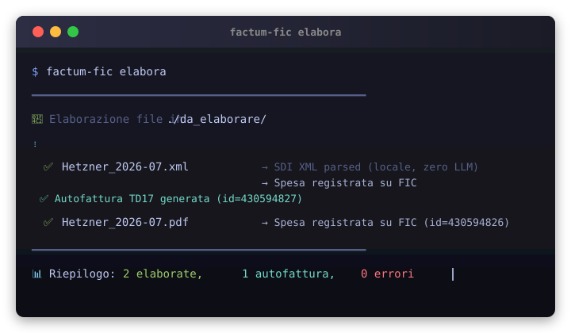
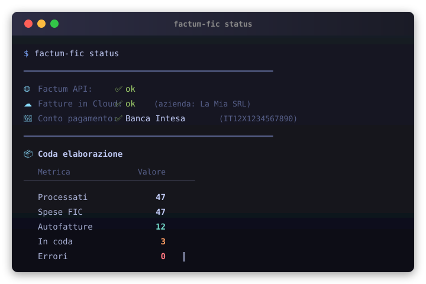
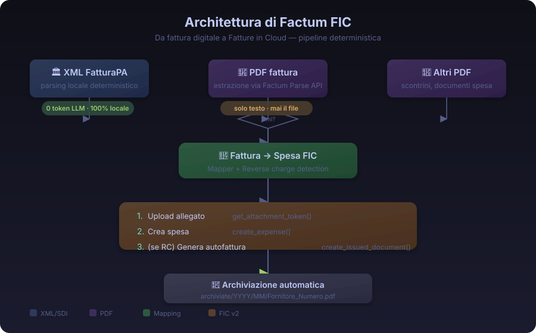

<div align="center">
  
  <h1>Factum FIC</h1>
  <p><strong>Da fattura digitale a Fatture in Cloud — automazione contabile deterministica</strong></p>
</div>

<p align="center">
  <a href="https://www.python.org/downloads/"></a>
  <a href="https://github.com/FTG-003/factum-fic/actions/workflows/ci.yml"></a>
  <a href="LICENSE"></a>
  <a href="https://github.com/FTG-003/factum-fic/releases"></a>
  <br>
  <a href="https://github.com/FTG-003/factum-fic/stargazers"></a>
  <a href="https://github.com/FTG-003/factum-fic/watchers"></a>
  <a href="https://github.com/FTG-003/factum-fic/forks"></a>
  <br>
  <a href="https://img.shields.io/badge/coverage-185%20tests-9ece6a?logo=pytest"></a>
  <a href="https://github.com/astral-sh/ruff"></a>
  <a href="https://github.com/python/typing"></a>
  <br>
  <a href="https://img.shields.io/badge/XML_SDI-100%25%20locale-73daca"></a>
  <a href="https://img.shields.io/badge/reverse_charge-N6.x%20%7C%20estero-f7768e"></a>
</p>

---

## 📋 Sommario

- [Panoramica](#-panoramica)
- [Installazione](#-installazione)
- [Guida rapida](#-guida-rapida)
- [Demo](#-demo)
- [Architettura](#-architettura)
- [Parser XML/SDI](#-parser-xmlsdi-deterministico)
- [Reverse charge](#-reverse-charge-intelligente)
- [Autofatture SDI](#-autofatture-td17td18td19)
- [CLI completa](#-cli-completa)
- [Sviluppo](#-sviluppo)
- [FAQ](#-faq)
- [Licenza](#-licenza)
- [English](#english)

---

## 🎯 Panoramica

**Factum FIC** automatizza la registrazione contabile delle fatture su **Fatture in Cloud v2**,
con un approccio **deterministico e trasparente**:

| Caratteristica | XML FatturaPA (`.xml`) | PDF fattura (`.pdf`) |
|---|---|---|
| **Motore di parsing** | `xml.etree.ElementTree` (locale) | Factum Parse API (LLM) |
| **Costo per elaborazione** | € 0,00 — zero API call | ~€ 0,001 per fattura |
| **Allucinazioni AI** | Impossibili (codice deterministico) | Gate di validazione Pydantic |
| **Reverse charge** | Natura SDI + paese fornitore | Rilevato dal testo |
| **Velocità** | ~50ms per documento | ~2-5 secondi |
| **Rete richiesta** | ❌ No (offline) | ✅ Sì |

Nato per **Partite IVA in Regime Forfettario** che vogliono automatizzare la contabilità
senza abbonamenti Enterprise.

---

## 📦 Installazione

### Con uv (consigliato)

```bash
uv tool install factum-fic
```

### Con pip

```bash
pip install factum-fic
```

### Da sorgente

```bash
git clone https://github.com/FTG-003/factum-fic.git
cd factum-fic
uv sync --all-extras --dev
```

### Configurazione rapida

```bash
# Setup guidato interattivo
factum-fic setup
```

Oppure crea un file `.env`:

```ini
# Obbligatorie
FIC_API_KEY="iltuo_token_personale"
FIC_COMPANY_ID="12345"

# Per parsing PDF (opzionale)
FACTUM_API_KEY="la_tua_chiave_factum"

# Opzionali
STRICT_CURRENCY=true
FIC_GENERATE_SELF_INVOICE=true
FIC_SELF_INVOICE_NUMERATION="/TD"
WATCH_DIR=~/Downloads
```

---

## 🚀 Guida rapida

```bash
# 1. Metti le fatture in elaborazione
cp ~/Downloads/fattura_*.xml ./da_elaborare/
cp ~/Downloads/fattura_*.pdf ./da_elaborare/

# 2. Elabora
factum-fic elabora

# 3. Verifica
factum-fic status
factum-fic history

# 4. (Opzionale) Watcher automatico
factum-fic watch
```

### Ciclo di vita dei file

```
da_elaborare/
├── fattura_12345.xml     → ✅ archiviate/2026/08/Fornitore_Numero.xml
├── fattura_2026-07.pdf   → ✅ archiviate/2026/08/Fornitore_Numero.pdf
├── duplicato.pdf         → ⚠️ archiviate/2026/08/... (stessa SHA-256)
└── corrotto.pdf          → ❌ da_verificare/corrotto.pdf (esame manuale)
```

---

## 🖥️ Demo

<p align="center">
  
</p>

<p align="center">
  
</p>

---

## 🏗️ Architettura

<p align="center">
  
</p>

### Componenti principali

| Componente | File | Ruolo |
|---|---|---|
| **Pipeline** | `core/pipeline.py` | Orchestratore: lock → parse → mappa → FIC → archivia |
| **Parser XML** | `core/extractors.py` | `parse_sdi_xml()` — parsing deterministico FatturaPA |
| **Mapper** | `core/mapper.py` | `FactumParseResult` → richieste FIC v2 |
| **FactumClient** | `core/factum_client.py` | Client HTTP per Factum Parse API (LLM) |
| **FICClient** | `core/fic_client.py` | Client HTTP per Fatture in Cloud v2 |
| **Queue** | `storage/queue.py` | Coda SQLite con lock atomico e stato SELF_INVOICE_PENDING |
| **Archiver** | `core/archiver.py` | Spostamento in `archiviate/YYYY/MM/` |
| **Watcher** | `watcher/daemon.py` | Monitoraggio hotfolder in tempo reale |

---

## 🏛️ Parser XML/SDI deterministico

Il cuore del progetto. Quando Factum FIC incontra un file `.xml`, lo parserizza
**senza chiamare alcuna API esterna**:

```xml
<FatturaElettronica>
  <FatturaElettronicaHeader>
    <CedentePrestatore>
      <DatiAnagrafici>
        <IdFiscaleIVA>
          <IdPaese>DE</IdPaese>
          <IdCodice>812871812</IdCodice>
        </IdFiscaleIVA>
        <Anagrafica>
          <Denominazione>Hetzner Online GmbH</Denominazione>
        </Anagrafica>
      </DatiAnagrafici>
    </CedentePrestatore>
  </FatturaElettronicaHeader>
  <FatturaElettronicaBody>
    <DatiGenerali>
      <DatiGeneraliDocumento>
        <Numero>4AUT</Numero>
        <Data>2026-07-02</Data>
        <Divisa>EUR</Divisa>
        <ImportoTotaleDocumento>15.69</ImportoTotaleDocumento>
      </DatiGeneraliDocumento>
    </DatiGenerali>
    <DatiBeniServizi>
      <DatiRiepilogo>
        <ImponibileImporto>15.69</ImponibileImporto>
        <Imposta>0.00</Imposta>
        <Natura>N6.9</Natura>
      </DatiRiepilogo>
    </DatiBeniServizi>
  </FatturaElettronicaBody>
</FatturaElettronica>
```

↓ **output strutturato**:

```json
{
  "ragione_sociale": "Hetzner Online GmbH",
  "partita_iva": "DE812871812",
  "paese": "DE",
  "numero": "4AUT",
  "data_emissione": "2026-07-02",
  "valuta": "EUR",
  "imponibile_totale": 15.69,
  "iva_totale": 0.0,
  "totale_documento": 15.69,
  "is_reverse_charge": true,
  "nature": ["N6.9"]
}
```

### Fallback di parsing

| Campo | Prima scelta | Seconda scelta | Terza scelta |
|---|---|---|---|
| Nome fornitore | `<Denominazione>` | `<Nome>` + `<Cognome>` | — |
| Partita IVA | `<IdFiscaleIVA>` | `<CodiceFiscale>` | — |
| Importi totali | Somma `<DatiRiepilogo>` | `<ImportoTotaleDocumento>` | `0.0` |
| Reverse charge | `<Natura>` N6.x | Paese ≠ IT + IVA=0 | `false` |

---

## 🔬 Reverse charge intelligente

Nello standard FatturaPA, **IVA = 0 non implica reverse charge**.
Un forfettario (N2.2) ha IVA=0 ma non è reverse charge. La logica corretta:

### Tavola decisionale

| Fornitore | Paese | IVA | Natura SDI | Reverse charge |
|---|---|---|---|---|
| Forfettario italiano | 🇮🇹 IT | 0,00 | **N2.2** | ❌ |
| Esente art. 10 | 🇮🇹 IT | 0,00 | **N4** | ❌ |
| Inversione contabile | 🇮🇹 IT | 0,00 | **N6.x** | ✅ |
| Fornitore tedesco | 🇩🇪 DE | 22,50 | *(nessuna)* | ❌ |
| Fornitore tedesco | 🇩🇪 DE | 0,00 | *(nessuna)* | ✅ |
| Fornitore USA | 🇺🇸 US | 0,00 | *(nessuna)* | ✅ |

### Codici Natura SDI

| Codice | Descrizione | RC |
|---|---|---|
| N1 | Escluse ex art. 15 | ❌ |
| N2.1 | Non soggette UE | ❌ |
| **N2.2** | **Non soggette — forfettario** | ❌ |
| N3 | Non imponibili | ❌ |
| **N4** | **Esenti** | ❌ |
| N5 | Margine | ❌ |
| **N6.1** | **Inversione contabile — beni** | ✅ |
| **N6.2** | **Inversione contabile — servizi** | ✅ |
| **N6.3** | **Inversione — subappalto** | ✅ |
| **N6.4** | **Inversione — edilizia** | ✅ |
| **N6.5** | **Inversione — energia** | ✅ |
| **N6.6** | **Inversione — rottami** | ✅ |
| **N6.7** | **Inversione — telefonia** | ✅ |
| **N6.8** | **Inversione — elettronica** | ✅ |
| **N6.9** | **Inversione — altro** | ✅ |
| N7 | IVA assolta in altro Stato UE | ❌ |

---

## 📄 Autofatture TD17/TD18/TD19

Factum FIC genera autofatture SDI automaticamente su Fatture in Cloud:

| Tipo | Descrizione | Quando |
|---|---|---|
| **TD17** | Integrazione servizi esteri | Fornitore extra-UE + IVA=0 |
| **TD18** | Integrazione beni UE | Fornitore UE + reverse charge |
| **TD19** | Integrazione beni extra-UE | Fornitore extra-UE + acquisto beni |

### Recupero guasti parziali

Se l'autofattura fallisce (es. FIC temporaneamente down), **la spesa è salvata**
in stato `SELF_INVOICE_PENDING`. Puoi riprovare:

```bash
# Verifica lo stato
factum-fic status
# → Pendenti SI: 1

# Riprova le autofatture fallite
factum-fic riprova-autofatture
```

---

## 🛠️ CLI completa

```
 Uso: factum-fic <comando> [opzioni]

 Comandi:
   elabora              Elabora file in da_elaborare/
   status               Dashboard stato e coda
   history              Cronologia elaborazioni
   verify               Verifica connettività API
   setup                Configurazione guidata
   watch                Avvia watcher hotfolder
   riprova-autofatture  Riprova autofatture pendenti

 Opzioni elabora:
   --force       Rielabora anche già processati
   --dry-run     Simula senza scrivere su FIC
   --verbose -v  Output dettagliato

 Opzioni watch:
   --daemon -d   Demone in background
   --dir PATH    Cartella da monitorare
   --interval S  Polling (default: 30s)
```

---

## 🧪 Sviluppo

### Requisiti

- Python 3.13+
- [uv](https://github.com/astral-sh/uv) (consigliato) o pip

### Setup

```bash
git clone https://github.com/FTG-003/factum-fic.git
cd factum-fic
uv sync --all-extras --dev
```

### Test & lint

```bash
# Suite completa
uv run pytest -q           # 185 test
uv run ruff check .        # zero errori

# Solo test specifici
uv run pytest tests/test_extractors.py -q
uv run pytest tests/test_remediation.py -q

# Con copertura
uv run pytest --cov=factum_fic --cov-report=term-missing
```

### CI/CD

| Evento | Azione | Secrets richiesti |
|---|---|---|
| `push` / `pull_request` su `main` | Ruff + Pytest (mock) | ❌ Nessuno |
| `workflow_dispatch` | Smoke test su produzione | ✅ FACTUM_API_KEY, FIC_API_KEY, FIC_COMPANY_ID |

---

## ❓ FAQ

**D: Devo avere Factum Parse API Key?**  
No. Gli XML funzionano offline, senza alcuna chiave. La chiave serve solo per i PDF.

**D: L'autofattura è inviata al SDI?**  
No. Factum FIC crea autofatture **interne a Fatture in Cloud** (registrazione contabile). L'invio al Sistema di Interscambio non è necessario per la contabilità interna.

**D: I miei dati finiscono su server esterni?**  
- **XML**: mai. Parsing 100% locale.  
- **PDF**: solo il testo estratto va a Factum Parse API. Il file originale mai trasmesso.  
- **FIC**: sì — è la destinazione finale dei dati contabili.

**D: Supporta valute estere?**  
Sì. USD/GBP/CHF → EUR con tassi BCE (Frankfurter API, cache 6h).  
Con `STRICT_CURRENCY=true` (default), la conversione fallisce con errore se il tasso non è disponibile (fail-fast).

**D: Cosa succede in concorrenza?**  
Lock atomico SQLite + `asyncio.Lock` in pipeline. Due processi non possono elaborare lo stesso file contemporaneamente.

---

## 📜 Licenza

**GNU Affero General Public License v3.0** — Open Source, Copyleft Forte.

Chi modifica e distribuisce via rete (SaaS) deve rilasciare il sorgente delle modifiche agli utenti.  
Le API [Factum Parse](https://factum.pyragogy.org) sono un servizio separato e non coperte da AGPL.

[Testo completo →](LICENSE)

---

<div align="center">
  <sub>Fatto con ❤️ da <a href="https://github.com/FTG-003">FTG-003</a></sub>
  <br>
  <sub>🇮🇹 Documentazione in Italiano · <a href="#english">🇬🇧 English version</a></sub>
</div>

---

<a name="english"></a>
<br>

<h1 align="center">Factum FIC <span style="font-weight:normal;font-size:0.6em">— English</span></h1>

<p align="center">
  <strong>Deterministic invoice processing for Fatture in Cloud</strong><br>
  XML/SDI parser + AI PDF parsing + FIC v2 API pipeline
</p>

<p align="center">
  
  
  
</p>

**Factum FIC** is an open-core CLI/daemon that automatically registers invoices on [Fatture in Cloud v2](https://www.fattureincloud.it/), Italy's leading accounting platform.

### Key features

- **SDI/XML parser** — local, deterministic FatturaPA parsing (zero API calls, zero hallucinations)
- **PDF parser** — AI-powered via Factum Parse API (text-only, file never leaves your machine)
- **Smart reverse charge** — N6.x codes + foreign supplier check (not simplistic IVA=0)
- **Auto self-invoices** — TD17/TD18/TD19 generated automatically
- **Currency conversion** — ECB rates (Frankfurter API, 6h cache)
- **Partial failure recovery** — expense saved even if self-invoice fails
- **Atomic deduplication** — SHA-256 + FIC pre-check + SQLite lock

### Quick start

```bash
pip install factum-fic
factum-fic setup                    # interactive config
cp invoice.xml ./da_elaborare/       # drop an XML invoice
factum-fic elabora                   # process → expense + self-invoice on FIC
factum-fic status                    # dashboard
```

### Commands

| Command | Purpose |
|---|---|
| `elabora` | Process files in `da_elaborare/` |
| `status` | Dashboard — API health, queue stats, pending SI |
| `history` | Processing history |
| `verify` | Test API connectivity |
| `setup` | Interactive configuration wizard |
| `watch` | Hotfolder watcher daemon |
| `riprova-autofatture` | Retry failed self-invoices |

### License

AGPL-3.0. Factum Parse API is a separate closed-source SaaS.

---

<p align="center">
  <a href="https://github.com/FTG-003/factum-fic">GitHub</a> ·
  <a href="docs/">Documentation</a>
</p>